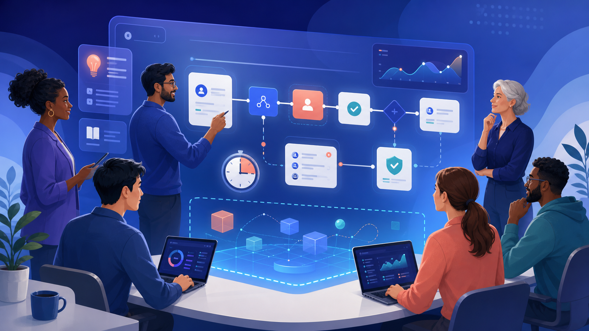
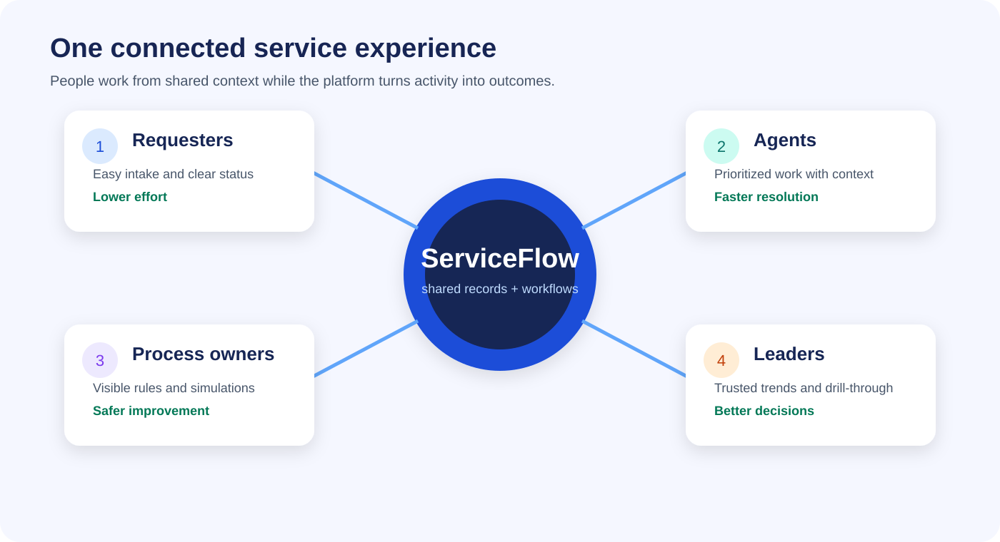
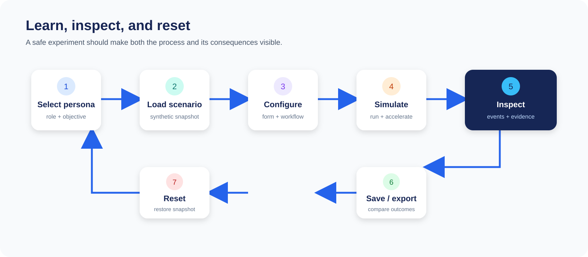
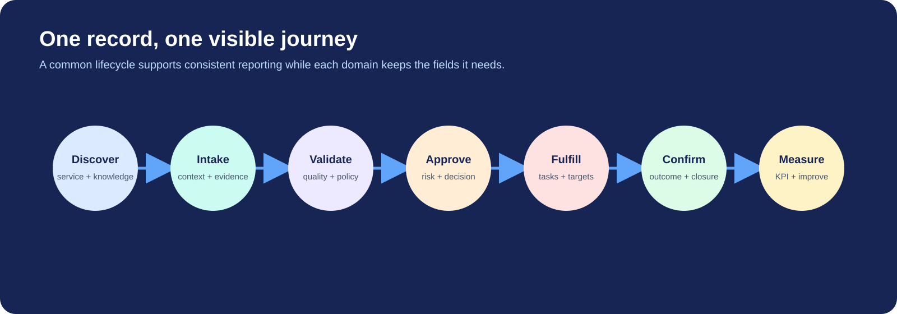
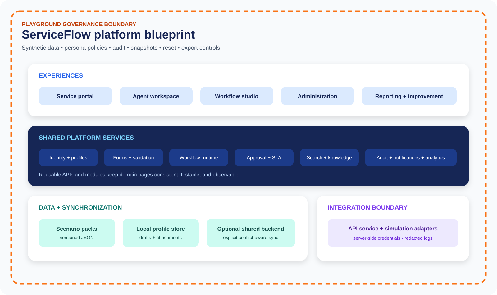

# ServiceFlow

## One-minute introduction

ServiceFlow is a proposed service-management playground for learning how connected work can replace scattered email, spreadsheets, chat messages, and one-off applications. Its core benefit is simple: a request enters once, the right people receive structured work, approvals and service targets move with it, and everyone sees the same status and history. Employees get a clear self-service experience; agents get prioritized queues and complete context; administrators can model repeatable workflows; leaders can see demand, performance, risk, and improvement opportunities.

The concept is informed by the platform patterns ServiceNow describes for IT service management: a shared data model, AI, workflow automation, self-service, and coordinated resolution of requests, incidents, problems, and changes. ServiceNow also demonstrates the value of a protected developer sandbox where ideas can be tested without affecting a customer instance. ServiceFlow applies those ideas to an approachable, synthetic-data environment: choose a persona, load a scenario, submit or route work, inspect every step, experiment safely, and reset when finished.

The expected result is faster learning, clearer process design, safer demonstrations, and a practical bridge from a prototype to an enterprise implementation. ServiceFlow is an independent concept and is not a ServiceNow product, implementation, or substitute.



> **Status:** This folder is a product and experience blueprint. It defines the proposed Playground, visual language, architecture, journeys, guardrails, and delivery roadmap; it is not yet a deployed application.

## Why ServiceFlow

Disconnected service work creates duplicate data entry, weak ownership, inconsistent approvals, missed targets, and limited reporting. ServiceFlow proposes one coherent experience around a shared record lifecycle.

| Audience | Experience | Benefit |
|---|---|---|
| Requester | Guided catalog, contextual help, status, and notifications | Less effort and fewer follow-ups |
| Agent | Prioritized work queues, complete record context, and playbooks | Faster, more consistent resolution |
| Approver | Clear decision context, risk, due date, and delegation | Faster decisions with accountability |
| Process owner | Visual workflows, forms, rules, SLAs, and simulations | Safer process improvement |
| Administrator | Personas, reference data, permissions, audit, and reset controls | Governed experimentation |
| Leader | KPIs, trends, bottlenecks, and drill-through | Better operational decisions |



## The proposed ServiceFlow Playground

The Playground is an isolated, resettable environment where learners and process teams can explore service-management behavior with synthetic data. It should feel realistic enough to teach the full lifecycle while making it impossible to confuse practice records with production work.

### Playground principles

1. **Safe by default.** Synthetic people, organizations, services, assets, and requests only. No production credentials or personal data.
2. **Learn by doing.** Every lesson begins with a persona and an outcome, then lets the user operate the process.
3. **Explain the system.** Each transition can reveal its trigger, condition, assignment, approval, SLA effect, notification, and data change.
4. **Reset with confidence.** Named snapshots and one-click resets make experimentation reversible.
5. **Local-first.** Draft records and preferences can remain tied to a local browser profile; optional server synchronization is explicit.
6. **Observable.** A timeline, workflow execution log, audit events, and KPI changes show what happened and why.
7. **Portable.** Scenarios and workflow definitions can be exported as JSON for review, reuse, or automated testing.
8. **Accessible.** Keyboard navigation, visible focus, semantic labels, helpful validation, and responsive layouts are baseline requirements.

### Playground loop



A guided session should take 10–30 minutes:

- Select a role such as employee, service-desk agent, change manager, approver, or platform administrator.
- Load a scenario with preconfigured records, assignments, service targets, and knowledge.
- Complete the intake form or modify the workflow definition.
- Run the scenario manually, automatically, or with accelerated time.
- Inspect record history, decisions, SLA calculations, notifications, and related records.
- Compare outcomes and export the evidence.
- Restore the starting snapshot or keep a named local version.

### Suggested scenario library

| Scenario | Skills practiced | Visible result |
|---|---|---|
| Restore employee access | Incident intake, categorization, knowledge, assignment, SLA | Resolved incident and reusable knowledge signal |
| Coordinate a major outage | Major incident, communications, child tasks, timeline | Shared incident command view and post-incident review |
| Investigate recurring failure | Problem, known error, workaround, RCA | Linked incidents and corrective action plan |
| Schedule a production change | Risk, conflict windows, approvals, implementation, review | Auditable change lifecycle with calendar impact |
| Request new equipment | Catalog variables, approval, fulfillment, asset assignment | Request, requested item, tasks, and assigned asset |
| Handle a customer case | Account context, entitlement, response target, escalation | Omnichannel-style case timeline and resolution |
| Onboard an employee | Cross-team journey, parallel tasks, dependencies | Coordinated HR, IT, security, and facilities work |
| Triage a security finding | Risk scoring, ownership, evidence, remediation | Controlled exception or verified remediation |

## Experience model

### 1. Unified service portal

- Search services, knowledge, and recent records from one entry point.
- Use audience-aware catalog items and guided intake.
- Save drafts locally under the authenticated profile.
- Follow progress, approvals, comments, attachments, and next actions.
- Provide clear empty, loading, success, warning, and failure states.

### 2. Agent workspace

- My work, team work, unassigned work, SLA risk, and escalations.
- Record form with business-specific fields and a chronological activity stream.
- Related knowledge, services, configuration items, requests, tasks, and parent/child records.
- Inline assignment, status, priority, collaboration, and resolution actions.
- Search, filters, column sorting, pagination, and CSV export for every table.

### 3. Workflow studio

- Visual steps with connectors, branches, approvals, timers, tasks, notifications, and integrations.
- A customized input schema for every step.
- Test data, breakpoints, validation, and step-by-step execution.
- JSON preview, copy, import, export, version history, and local save.
- Execution logs that connect each runtime event back to its design step.

### 4. Administration and governance

- Users, groups, roles, services, categories, SLAs, reference data, and scenario packs.
- Role and persona simulation without real identity impersonation.
- Local cache inventory with record-level delete and clear-all controls.
- Data classification, retention, audit visibility, and environment labeling.
- Promotion gates for moving an approved design beyond the Playground.

### 5. Reporting and improvement

- Operational KPIs with links back to filtered work queues and records.
- Temporal, comparison, composition, relational, and distribution charts.
- Demand, resolution, backlog, SLA, rework, approval delay, and experience measures.
- Workflow bottlenecks and before/after scenario comparisons.
- Metric definitions beside each visualization so users understand the calculation.

## Core record journey



Every service domain can use the same lifecycle vocabulary while keeping a domain-specific intake form:

1. **Discover:** search services and knowledge; select the correct entry point.
2. **Intake:** capture business context, affected service, urgency, evidence, and desired outcome.
3. **Validate:** enforce required fields, eligibility, data quality, duplicates, and policy rules.
4. **Approve:** provide decision context, approver policy, due date, delegation, and rationale.
5. **Fulfill:** create and route tasks, coordinate dependencies, and track service targets.
6. **Confirm:** validate the outcome with the requester and record closure information.
7. **Measure:** update KPIs, surface improvement opportunities, and preserve the audit trail.

## Proposed platform architecture



### Experience layer

Responsive Bootstrap 5 pages provide the portal, workspaces, intake journeys, workflow designer, administration, and reporting. A shared shell preserves authentication context, sidebar state, theme, accessibility preferences, and recent navigation.

### Platform services

Reusable modules provide identity context, form schemas, workflow execution, assignment, approvals, SLA calculations, notifications, search, knowledge recommendations, attachment validation, audit events, reporting, and import/export.

### Data and synchronization

The Playground starts with versioned JSON scenario packs. Local browser storage holds profile-specific drafts, preferences, attachments, workflow versions, and saved records. When a server is enabled, synchronization is deliberate, observable, and conflict-aware; a matching local record wins until the user explicitly reconciles it.

### Integration boundary

All remote calls pass through one API service. Credentials remain server-side. Connectors use named configurations, allowlists, timeouts, retry rules, and redacted logs. Simulation adapters replace production systems in Playground mode.

### Governance boundary

Environment banners, synthetic-data checks, role policies, audit logging, export controls, data retention, and reset policies surround the experience. A Playground design cannot silently promote itself to production.

## Information model

The minimum shared model should connect:

- **People and organizations:** user, group, role, company, department, location.
- **Service portfolio:** business service, technical service, offering, owner, support group.
- **Work:** request, requested item, task, incident, major incident, problem, change, case, approval.
- **Knowledge:** article, version, feedback, ownership, review, expiration.
- **Configuration:** configuration item, asset, relationship, contract, entitlement.
- **Automation:** workflow, version, trigger, step, execution, decision, timer, error.
- **Measurement:** SLA definition, task SLA, KPI, target, snapshot, survey response.
- **Evidence:** attachment metadata, comment, activity event, audit event, notification.

Record identifiers must be stable. All table links should open a form using query parameters such as `?recordId=INC0010042&mode=edit&step=triage`. The form should load the complete record, merge a matching local version, give local data precedence, and default to the correct process step.

## Playground safety and privacy

- Use unmistakably synthetic names and `example.test` email addresses.
- Reject secrets, access tokens, government identifiers, banking credentials, and production exports.
- Display **PLAYGROUND — NON-PRODUCTION** in every page shell and exported artifact.
- Store attachments only after type, size, and malware-boundary checks; document browser quota limits.
- Allow PDF, DOCX, JSON, XML, PNG, JPG, WEBP, and GIF only when required by a scenario.
- Encrypt server-side data in transit and at rest when synchronization is enabled.
- Require consent before local profile data is exported or synchronized.
- Provide per-record deletion, attachment deletion, and clear-all local cache controls.
- Log simulation actions without recording secrets or unnecessary personal data.
- Expire inactive sessions, but reset the timer on keyboard, pointer, touch, and meaningful page activity.

## Reference implementation structure

```text
ServiceFlow/
├── README.md
├── assets/
│   ├── serviceflow-hero.png
│   ├── serviceflow-platform-architecture.svg
│   ├── serviceflow-playground-lifecycle.svg
│   ├── serviceflow-request-journey.svg
│   └── serviceflow-value-map.svg
└── docs/
    ├── image-prompts.md
    └── playground-blueprint.md
```

A future application implementation should add modular `js/modules/`, `js/services/`, versioned `data/` scenario packs, verification tests, and deterministic publication records. Shared API, storage, form, table, toast, session, and workflow services should remain the only seams used by feature pages.

## Delivery roadmap

### Phase 1 — Learning foundation

- Shared shell, local profile, synthetic users, scenario loader, service catalog, incident, request, approval, and change journeys.
- Reusable form serializer, validation, toast, table, attachment, session, and storage services.
- Playground label, reset, local cache management, JSON import/export, and execution timeline.

### Phase 2 — Process design

- Visual workflow designer, per-step schemas, branches, approvals, timers, reusable actions, and test runner.
- Problem/RCA, major incident, customer case, knowledge, asset/CMDB, and service-level scenarios.
- Snapshot comparison, workflow versioning, and automated scenario assertions.

### Phase 3 — Shared sandbox

- Server database, authenticated teams, role-based access, record versioning, audit trail, and governed attachments.
- Optional synchronization, conflict resolution, notifications, scheduled work, and integration simulations.
- Environment promotion workflow and automated regression suite.

### Phase 4 — Enterprise readiness

- SSO/MFA, fine-grained authorization, data retention, monitoring, backup/recovery, integration gateway, and operational support model.
- Production-grade workflow runtime, SLA calendar engine, analytics history, accessibility certification, and security review.
- Governed AI assistance only after authoritative data, permissions, audit, and human review controls are established.

## Success measures

| Outcome | Example measure |
|---|---|
| Faster learning | Median time to complete a guided scenario |
| Better process quality | Validation failures found before promotion |
| More automation | Percentage of steps completed without manual reassignment |
| Better service performance | SLA attainment and median resolution time |
| Better experience | Requester effort score and completion rate |
| Safer experimentation | Reset success, synthetic-data compliance, and zero production calls |
| Better decisions | Percentage of KPIs with working record-level drill-through |

## Definition of done for a Playground scenario

A scenario is complete when it has a named persona, learning objective, synthetic seed data, domain-specific intake form, workflow definition, assignments, approvals, service targets, expected notifications, success and failure paths, observable execution log, linked records, KPI effects, automated assertions, exportable evidence, and a tested reset path.

## Source and inspiration

This proposal uses public ServiceNow material as design inspiration:

- [ServiceNow IT Service Management documentation](https://www.servicenow.com/docs/r/it-service-management/r_ITServiceManagement.html) describes ITSM on a cloud platform with a shared data model, AI, and workflow automation.
- [How the ServiceNow AI Platform works](https://www.servicenow.com/docs/r/platform-administration/how-now-platform-works.html) describes a unified foundation spanning data, workflows, AI, and security.
- [ServiceNow App Engine Studio](https://www.servicenow.com/products/app-engine-studio.html) highlights low-code creation, visual workflows, reusable guidance, collaboration, and guardrails.
- [ServiceNow Personal Developer Instance Guide](https://developer.servicenow.com/print_page.do?category=developer-program&identifier=obtaining-a-pdi&module=guide&release=yokohama) describes a sandbox for experimentation that does not affect a customer or partner instance.

ServiceNow and related product names are trademarks of their respective owner. ServiceFlow is presented here as an independent educational and prototyping concept.
